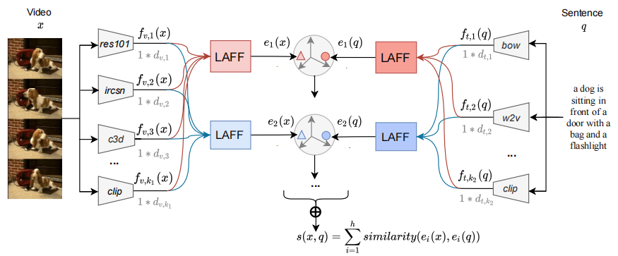

#  ECCV2022: LAFF for Text-to-Video Retrieval

This is the official source code of our LAFF paper: [Lightweight Attentional Feature Fusion: A New Baseline for Text-to-Video Retrieval](https://arxiv.org/abs/2112.01832).



## Environment

We used Anaconda to setup a deep learning workspace that supports PyTorch. Run the following script to install all the required packages.

```shell
conda create -n laff python==3.8 -y
conda activate laff
git clone https://github.com/ruc-aimc-lab/laff.git
cd laff
pip install -r requirements.txt
```


## Downloads

### Data

See the [data](data) page. 


### Trained Models

Provide model links here.

## Code

The [shell](shell) folder provides scripts that perform training from scratch. 

## Performance

+ Video features: *clip-ft*, *x3d*, *ircsn* and *tf*.
+ Text features: *clip-ft*, *bow*, *w2v* and *gru*.

### MV-test3k

| Model   | R1   | R5   | R10  | Medr |
| ------- | ---- | ---- | ---- | ---- |
| W2VV++ |23.0|49.0|60.7|6|
| SEA |19.9|44.3|56.5|7|
| CLIP-finetuned |27.7|53.0|64.2|5|
| LAFF    | 28.0 | 53.8 | 64.9 | 4    |
| LAFF-ml | 29.1 | 54.9 | 65.8 | 4    |

### MV-test1k

| Model   | R1   | R5   | R10  | Medr |
| ------- | ---- | ---- | ---- | ---- |
| W2VV++ |39.4|68.1|78.1|2|
| SEA |37.2|67.1|78.3|2|
| CLIP-finetuned |39.7|67.8|78.4|2|
| LAFF    | 42.2 | 70.7 | 81.2 | 2    |
| LAFF-ml | 42.6 | 71.8 | 81   | 2    |

###  MSVD

| Model   | R1   | R5   | R10  | Medr |
| ------- | ---- | ---- | ---- | ---- |
| W2VV++ |37.8|71.0|81.6|2|
| SEA |34.5|68.8|80.5|3|
| CLIP-finetuned |44.6|74.7|84.1|2|
| LAFF    | 45.2 | 75.8 | 84.3 | 2    |
| LAFF-ml | 45.4 | 76.0 | 84.6 | 2    |

### TGIF

| Model   | R1   | R5   | R10  | Medr |
| ------- | ---- | ---- | ---- | ---- |
| W2VV++ |22|42.8|52.7|9|
| SEA |16.4|33.6|42.5|17|
| CLIP-finetuned |21.5|40.6|49.9|11|
| LAFF    | 24.1 | 44.7 | 54.3 | 8    |
| LAFF-ml | 24.5 | 45.0 | 54.5 | 8    |

### VATEX

| Model   | R1   | R5   | R10  | Medr |
| ------- | ---- | ---- | ---- | ---- |
| W2VV++ |55.8|91.2|96|1|
| SEA |52.4|90.2|95.9|1|
| CLIP-finetuned |53.3|87.5|94.0|1|
| LAFF    | 57.7 | 91.3 | 95.9 | 1    |
| LAFF-ml | 59.1 | 91.7 | 96.3 | 1    |


## Citation

```latex
@inproceedings{eccv2022-laff,
title = {Lightweight Attentional Feature Fusion: A New Baseline for Text-to-Video Retrieval},
author = {Fan Hu and Aozhu Chen and Ziyue Wang and Fangming Zhou and Jianfeng Dong and Xirong Li},
year = {2022},
booktitle = {ECCV},
}
```


## Contact

If you enounter any issue when running the code, please feel free to reach us either by creating a new issue in the github or by emailing

- Fan Hu ([hufan_hf@ruc.edu.cn](mailto:hufan_hf@ruc.edu.cn))
- Ziyue Wang (wangziyueamy@sina.com)
- Aozhu Chen ([caz@ruc.edu.cn](mailto:caz@ruc.edu.cn))
